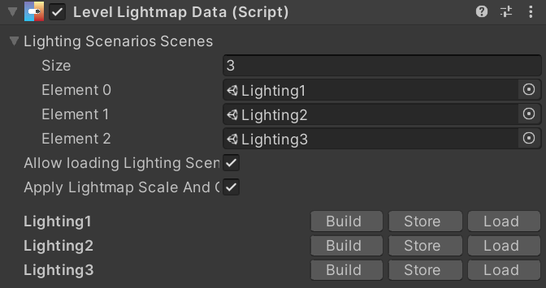

# com.pixelwizards.lightmap-switching
====================

[](https://openupm.com/packages/com.pixelwizards.lightmap-switching/)

[forked & modified from LaurentH's original repo: https://github.com/laurenth-personal/lightmap-switching-tool]

[](https://www.youtube.com/watch?v=7lqGM1kvU-0)


Installation
--------------

### Install via OpenUPM

The package is available on the [openupm registry](https://openupm.com). It's recommended to install it via [openupm-cli](https://github.com/openupm/openupm-cli).

```
openupm add com.pixelwizards.lightmap-switching
```

### Install via git url

Add this to your project manifest.json

```
"com.pixelwizards.lightmap-switching": "https://github.com/PixelWizards/com.pixelwizards.lightmap-switching.git",
```

OpenUPM Support
----------------

This package is also available via the OpenUPM scoped registry: 
https://openupm.com/packages/com.pixelwizards.lightmap-switching/

Prerequistes
---------------
* This has been tested for `>= 2018.3`

Usage
---------------
Tool intended for **switching pre-baked lightmaps** and realtime lighting on a static scene at runtime.

Depending on the platform or depending on the content the switch might not be instant but take some seconds, this script just allows you avoid duplicating your scene if you just want to change the lighting.

This version is compatible with **unity 2019.3b4** and above. If you require versions for prior releases, check Laurent's source repo for unity 5.5 - 5.6 version.

If you want to use lightmaps of different resolutions in your different lighting scenarios you will probably need to **disable static batching** in the PlayerSettings (if you use the same lightmap resolution on all your lighting scenarios and the object packing in the lightmap atlas doesn't change accross lighting scenarios it's ok to keep static batching enabled).

The system relies on 2 components :

**LevelLightmapData**
This is the core container that you need in your scene to references the different lighting scenarios, build the lighting, and stores the dependencies to the lightmaps.



**LightingScenarioSwitcher**
This is just an example of asset that calls the LevelLightmapData in order to switch lightmaps at runtime. You could build other components that call the LevelLightmapData in the same way but on different events (like you could use a box trigger running the same script on OnTriggerEnter ).

**LightmapSwitchTrack**

A custom Timeline track that allows you to dynamically switch lightmaps on a Timeline sequence. 

### How it works :

- Make a scene with your static geometry only. Disable Auto baking (important). If you want to use lightprobes, also add a lightprobe group to the geometry scene.
- Make several lighting scenes in your project. These scenes should not contain static geometry. The Lighting scene settings must not use auto baking.
- Add your lighting scenes and your static geometry scene to your Build Settings scene list.
- In your static geometry scene, add an empty gameObject and attach a **LevelLightmapData** component to it. 
- Fill the "lighting scenarios size" with the count of lighting scenarios you want, and in the "element" fields, either drag and drop scenes from your Project view or click the little point on the right of the field to choose a scene from your project
- One by one, you can now Build the lighting scenario, and when the bake is done Store it. You need to do these steps in the lighting scenario order ( you have to build and then store lighting scenario 1 before lighting scenario 2 according to the order in the list). The first time it is crucial to do it in the right order, if you misclicked I'd recommend redoing the whole setup (click the wheel in the top right corner of the component and hit "reset" and do the setup again).
- Now add an empty Gameobject to your scene and add a **LightingScenarioSwitcher** for previewing the switch
- The Default lighting scenario field is the ID of the lighting scenario you want to load when you start playing. The ID is the number associated to the lighting scenario in the LevelLightmapData ( ID of the first element in the list is 0, next one is 1, etc ... )
- Start playing 
-> When clicking ( left mouse button or Fire1 if you have changed the input assignments ) the lightmaps should switch between your different lighting scenarios.

- Mixed lighting mode are supported (tested only "baked indirect" and "shadowmask")
- Reflection probes supported, they need to be placed in the lighting scenes.

### LATEST UPDATE :

- Updated to 2019.3.7f1
- Added TimelineSwitchTrack for Timeline support
- Added 'Load' functionality to the LevelLightmapData UI so you can easily load the lightmap scenarios at Edit time
- The path to the lighting scenes is no longer hardcoded
- The UI of the level lightmap data is slightly nicer (not a big change)
- Add note about scenes needing to be in the build settings scene list
- update readme accordingly

### Contributions :
- Huge thanks to LaurentH for the original core functionality - all I've done is a bit of reorg and extending to support Timeline
- Thanks to [Kretin1](https://github.com/Kretin1) for his effort on shadowmask support.
